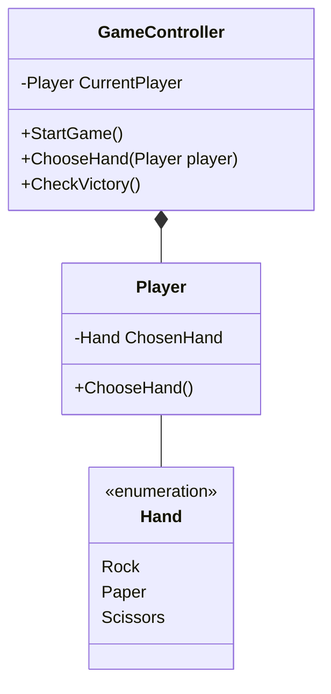

```mermaid
classDiagram
  class GameController {
    -Player CurrentPlayer

    +StartGame()
    +ChooseHand(Player player)
    +CheckVictory()
  }

  class Player {
    -Hand ChosenHand
    +ChooseHand()
  }

  class Hand {
    Rock
    Paper
    Scissors
    <<enumeration>>
  }

  GameController *-- Player
  Player -- Hand
```