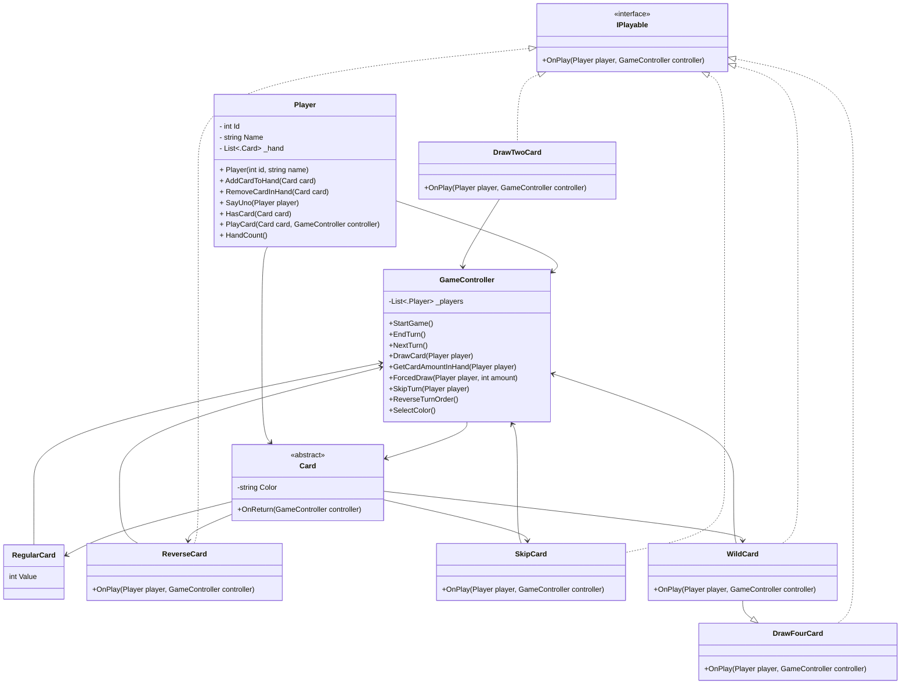

```mermaid
classDiagram
  class GameController {
    -List<.Player> _players
    +StartGame()
    +EndTurn()
    +NextTurn()
    +DrawCard(Player player)
    +GetCardAmountInHand(Player player)
    +ForcedDraw(Player player, int amount)
    +SkipTurn(Player player)
    +ReverseTurnOrder()
    +SelectColor()
  }

  class Card {
    -string Color
    +OnReturn(GameController controller)
  }
  <<abstract>> Card

  class RegularCard {
    int Value
  }

  class ReverseCard {
    +OnPlay(Player player, GameController controller)
  }

  class DrawTwoCard {
    +OnPlay(Player player, GameController controller)
  }

  class DrawFourCard {
    +OnPlay(Player player, GameController controller)
  }

  class SkipCard {
    +OnPlay(Player player, GameController controller)
  }

  class WildCard {
    +OnPlay(Player player, GameController controller)
  }

  class IPlayable {
    +OnPlay(Player player, GameController controller)
  }
  <<interface>>IPlayable

  class Player {
    - int Id
    - string Name
    - List<.Card> _hand

    + Player(int id, string name)
    + AddCardToHand(Card card)
    + RemoveCardInHand(Card card)
    + SayUno(Player player)
    + HasCard(Card card)
    + PlayCard(Card card, GameController controller)
    + HandCount()
  }

  IPlayable <|.. ReverseCard
  IPlayable <|.. SkipCard
  IPlayable <|.. WildCard
  IPlayable <|.. DrawTwoCard
  IPlayable <|.. DrawFourCard

  Card --> RegularCard
  Card --> ReverseCard
  Card --> SkipCard
  Card --> WildCard

  GameController --> Card

  Player --> Card
  Player --> GameController

  DrawTwoCard --> GameController
  RegularCard --> GameController
  ReverseCard --> GameController
  SkipCard --> GameController
  WildCard --> GameController
  WildCard --|> DrawFourCard
```
